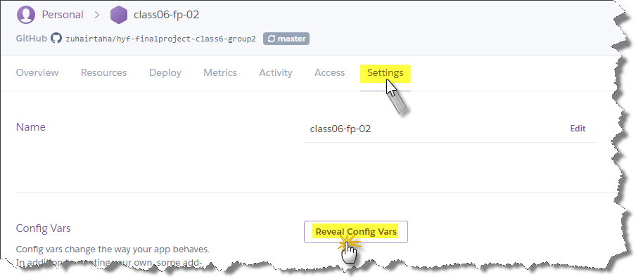
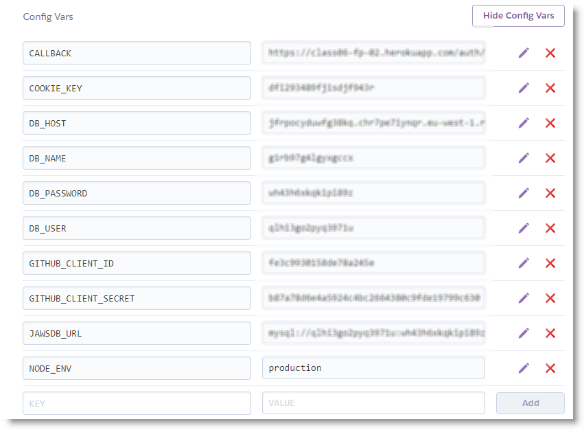

# HackYourFuture Final Project
### (Class 6 - Group 2)
 


Web application to manage HackYourFuture programming school (Copenhagen). This application allow users (admin, mentors, students) to 
view/ manage classes, modules, events, ...

## .dotenv
It's important to install `npm i dotenv` to be able to use `.env` file at the project.
after installing it create `.env` file: you can use command line `touch .env`

Your file could be like this:
```dotenv
NODE_ENV=development

###### Github OAuth ######
GITHUB_CLIENT_ID=
GITHUB_CLIENT_SECRET=
CALLBACK=
COOKIE_KEY=

##### Databases ########
DB_PORT=3306

# local database
DB_USER=
DB_PASSWORD=
DB_NAME=
DB_HOST=

#Heroku online database
#DB_NAME=
#DB_HOST=
#DB_PASSWORD=
#DB_USER=
```
***Notes:*** 
* Dont forget to add `.env` to `.gitignore` file
* I added both local/online databases, but comment one of them and uncomment what you want to work with

### Set config vars at heroku
 

open your repo at heroku > settings > Reveal Config Vars
and fill the same `.env` data here:

 


## Database (knex)
ERD (Entity Relationship Diagram)


database generated with [knex js](https://knexjs.org/) 
to generate the same database at your localhost/ hosting:
* **install knex globally** ` npm i -g knex` ***This is important step (Locally is not enough)***
* install it locally at your project `npm i knex`
* navigate to database folder witch located at `src/server/database` by running this command 
`cd src/server/database`. After navigating to it you can run next steps:
* To **migrate** the database structure run: `knex migrate:latest`
* To fill the database with data (**seed**) run: `knex seed:run`
Now you should have the same database (structure & data)

_You can migrate/seed to heroku database by comment the local database data at `.env` file and uncomment heroku data then do the same previous steps_

## More detais about knex
* If you want to use knex from scratch at your project at first you need to install it globally/ locally as I mentioned up and navigate to the folder we want to put your migration/seed files in.
* After that, run `knex init` this will create `knexfile.js`
* replace `knexfile.js` content with:
```javascript
require('dotenv').config({path: '../../../.env'})

module.exports = {
  client: 'mysql2',
  connection: {
    host: process.env.DB_HOST,
    user: process.env.DB_USER,
    password: process.env.DB_PASSWORD,
    database: process.env.DB_NAME
  }
}
```
you can use `mysql2` / `mysql` or any other module to handle with your database.
At first line we have set the path where `.env` file exists. I tried to run knex commands without setting it, but it didn't work, so it's important to set it with your `.env` relative path.
* create your database. Because knex don't create it, so we have to do that manually.
* navigate to your database path. in our project `cd src/server/database`
* to create a table at the database, for example users table run:
```javascript
knex migrate:make users
```
* This will create a file similar to `20181230010800_users.js` replace it contents with:
```javascript
exports.up = function (knex, Promise) {
  return knex.schema.createTable('mentors', table => {
    table.increments()
    table.string('name').notNullable()
    table.string('email')
    table.string('password')
    table.timestamps(true, true)
  })
}

exports.down = (knex, Promise) => knex.schema.dropTable('users')
```
don't forget to set the table name at the two places. the last code will generate a table with
id primary key. also name, email, and password varchar fields. and finally created_at and updated_at fields.

_Read more about [Schema Builder](https://knexjs.org/#Schema)_
* Now we are ready to migrate this table to the database by running: 
```javascript
knex migrate:latest
```
* If we made changes at the database we can undo last changes by run:
```javascript
knex migrate:rollback
```
* **Seeding** data to last table: to create seed file run
```javascript
knex seed:make users
```
This will create a file called `users` at the folder `seeds`
* fil the seed file with `json` data. You can use some npm modules like `faker` to crate dummy data
* finally run 
```javascript
knex seed:run
```
and the table(s) will be filled with the data
###Note:
- Migrate/Seed files order is important. For example: to create `students_classes` table with relations between tables, we must create
both `students`/`users` and `classes` before.
Also for seeding we cannot seed `students_classes` before seeding `classes` ... **So rename files by numbers prefix or alphabetically** 

- There is also some scripts at `package.json` to run migrate/seed quickly. We can run them locally or online.
To run them online at heroku open console


and write the migrate/seed:


